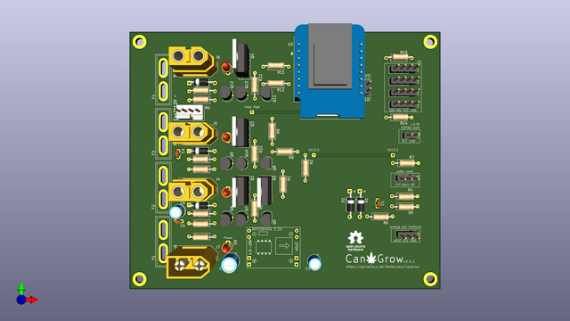

# CanGrow

### Origin: https://git.la10cy.net/DeltaLima/CanGrow
For source code and releases, please go there! :)

An easy to use DIY grow controller firmware (for cannabis).

## WORK IN PROGRESS

## Motivation
I havn't found an already existing grow controller project within the ESP / Arduino Core eco system which 
met my personal requirements. 
Those are an easy DIY, using low cost parts, Arduino Core sourcecode to hack own things together, having a WebUI, grab some Metrics for monitoring, standalone and my very special need that the Hardware should run completely with 12V. 

### Update 09.12.2024 - Release of CanGrow firmware v0.1.0

After some feedback of users from the forum [grower.ch](https://grower.ch) (thank you guys!) I somewhat finalized firmware version v0.1 so this would be in a usable state for others to use. 
Work on v0.2 is progressing slowly, so it is better when the code, which already exists, exists in usable way :) 

**Release notes:**

First non-dev release of CanGrow Firmware v0.1 branch

I would call this the first "official" release, which is usable. It does not (yet) contain all functions and features I planned to implement, but those will come with v0.2 of the firmware, which is already in progress for about a month now. 

CanGrow Firmware v0.1.0 is made for the CanGrow PCB, but you can of course run it with your own hardware. Firmware v0.2 will be fully platform independent. 

# Setup 

## Perform a factory reset, after you have flashed the firmware to your ESP8266 (for the first time or having problem like crash loops)!

You perform a factory reset (wipe) by connecting Pin D4 with GND (WIPE on the CanGrow PCB) when the builtin LED of the ESP8266 blinks three times during start. Hold for three seconds, then release. The builtin LED should now flash faster and the ESP should restart.
Now you will see an open unprotected Wifi called `CanGrow-unconfigured`, connect to it and open the address [http://192.168.4.20](http://192.168.4.20) and you can now start setup up your CanGrow device :)

# Features

- Gather Values from sensors
  - Temperature
  - Humidity
  - Soilmoisture
- Time based (ntp) Light control
  - Smooth Fade in and fade out configurable
- Control of two Fans
  - FAN1 is controlled by PWM supply Voltage
  - FAN2 is controlled by PWM 4 Pin Fan header
- Simple watering control
  - 3 modes for water plan
    - By soilmoisture value
    - by time (every n days, different interval for vegetation and bloom phase)
    - both combined
- Define the different phases of your grow
  - Set amount of days for vegetation and bloom phase. 
  - After bloom phase CanGrow enters harvest mode by its own, which means the light and watering system gets disabled
- Maintenance Mode
  - When using LED PWM, you can activate Maintenance Mode, which dimms the light. (at night it will turn on when enabling maintenance mode)
- ESP32Cam integration on the Dashboard
- Support for SSD1306 128x64 I2C OLED display
  - rotates through three different screens
- Get measured values as json
  - `GET /api/sensors`

# Supported Sensors
- Analog capacitive soilmoisture 
- I2C Chirp (https://wemakethings.net/chirp/)
  - Soilmoisture
  - Temperature
- I2C BME280
  - Temperature
  - Humidity
- I2C SHT31
  - Temperature
  - Humidity
- Analog water level indicator
  - Builtin on CanGrow PCB
  - simple voltage divider, check out https://deltalima.org/blog/index.ph...e-step-water-level-indicator-for-arduino-esp/
 
# Todo
This version branch v0.1.x will receive only bugfixes and small changes. Work on the next v0.2 has already began, which is a complete rewrite. If you are curious , check out the branch "firmware_v0.2-dev", any feedback is welcome!

***

### Update 14.09.2024 - Code Rewrite v0.2

I took some "summer break" from the project, and had the opportunity to talk to different people about it.
My conclusion at this point is, that the focus of this project is not the Hardware, it came out that it should be the software.
So I decided to completely rewrite the code from 0 - with recycling some parts of it. 
Goal of the Rewrite is that the Firmware becomes more independent of the hardware used. It has to support both ESP8266 and ESP32 
and let the user decide at which pin which output, sensor or whatever will be connected to. Like done in the [Tasmota](https://github.com/arendst/Tasmota) Firmware, I also want to support "Hardware Templates" which come with presets for PCBs like the one I created.

**Checklist for v0.2 Firmware**
- Support ESP8266 and ESP32 
- AsyncWebserver instead ESP8266Webserver
- LittleFS instead of EEPROM()
- deliver static HTML, dynamic Stuff with Javascript
  - (or is there a better way? please tell me!)
- Free configurable outputs
  - Main outputs for Light, Air, Water 
  - Support for Tasmota Wifi Plugs (and others?)
  - No Limitation for Amount of outputs 
  - Light
    - support for I2C 0-10V Dimm control
    - PWM dimm control
  - Air
    - support for I2C 0-10V Dimm control
    - PWM dimm control
    - Support for humidifier, heater (, CO2?)
    - Read Fan RPM
  - Water
    - Usual watering
    - Pump for fertilizer
- Free configurable Inputs
  - Support for various I2C devices
    - All kind of sensors for Temp, Humidity, Moisture, and so on
    - Support for ADCs to connect multiple analoge sensors
  - Support for Analog inputs
    - onboard ones or I2C (ADC)
    - Analog Multiplexer support (like CD4051)
  - Calibrate sensors 
    - define 0% and 100% values
    - Offsets
- MQTT support
- API

***  
  
## Old v0.1 Features / ToDo List

- Measure values :white_check_mark:
  - Humidity :white_check_mark:
  - soil moisture :white_check_mark: 
  - temperature :white_check_mark:
  - water level for water tank :white_check_mark:
- LED grow light control (on/off, dimming, max. 12V 50W load ) :white_check_mark:
  - You can of course use a relais as well, if you want to drive 220V lights :white_check_mark:
- fan control (on/off, (PWM?) max 1A) :white_check_mark:
- pump control for automatic watering (max 1A) :large_blue_circle:
- Web UI and REST API for data and controlling :large_blue_circle:
  - simple web ui :white_check_mark:
  - REST API :large_blue_circle:
  - Send notifications with web call (e.g. for mastodon) :red_circle:
  - predefined grow profiles :large_blue_circle:
  - persistent data :white_check_mark:
    - Start of Grow :white_check_mark:
    - day of grow :large_blue_circle:
    - grow profile 
      - watering amount per week :large_blue_circle:
      - light cycle :white_check_mark:
    - wifi settings :white_check_mark:
    - settings in general :white_check_mark:
- Easy to build and use for beginners (i hope so!) :white_check_mark:
  - PCB layout to order from manufacture (jlcpcb or pcbway) :white_check_mark:
  - easy to build up on a perfboard :white_check_mark:
  - easy to etch pcb :white_check_mark:
  - easy to access and modify :white_check_mark:
  - low cost as possible! :white_check_mark:

:white_check_mark: Done - :large_blue_circle: In Progress - :red_circle: ToDo
