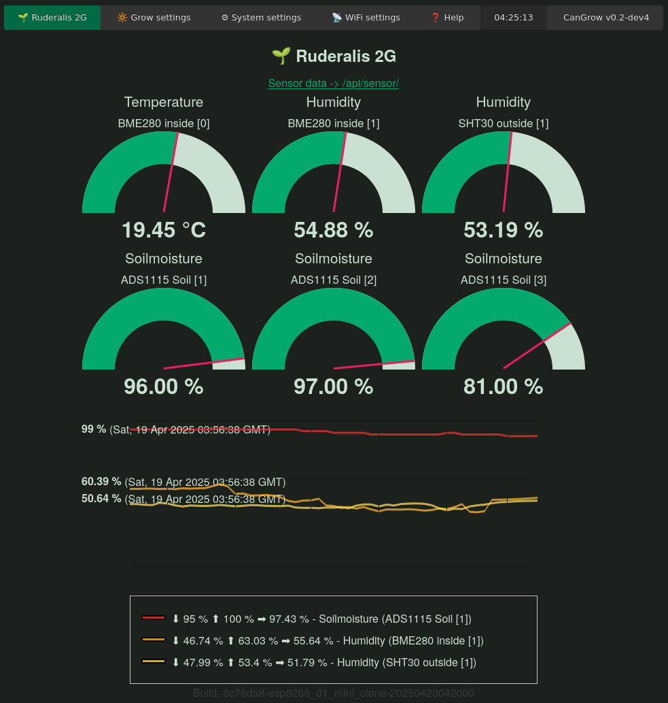
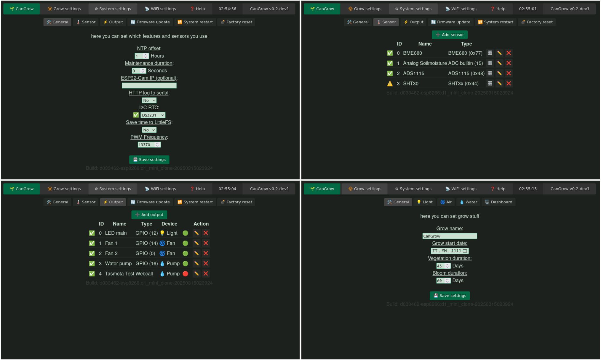

#  CanGrow - An OpenSource grow controller firmware for ESP8266 / ESP32

CanGrow is a firmware for ESP microcontrollers to control and monitor all plant needs. It can be understood as lightweight alternative to HomeAssistant for plant growing systems.

⚠️⚠️⚠️
### Origin: https://git.la10cy.net/DeltaLima/CanGrow
For source code and releases, please go there! :)

⚠️⚠️⚠️

## 🌱 Features

- Support for ESP8266 and ESP32 microcontrollers
- Everything runs on the ESP microcontroller itself, no need for HomeAssistant
- Lightweight WebUI with integrated Dashboard
- Dasboard with Gauges and simple Linechart
- Data Logging into builtin flash with LittleFS for the line chart to see past 32 hours
- Free and flexible configuration of outputs (GPIO, HTTP, I2C) and sensors (builtin ADC, I2C modules)
- Sensor values offered by JSON API `/api/sensor/`
- Platform independent - Build your own hardware and drive it with the CanGrow firmware
- Set different light times for Vegetation and Bloom phase
- Simple watering plans, based on time interval and/or sensor value
- Control fan outputs depending on sensor values
- Support for I2C RTCs to keep the time when NTP is not available
- Support for I2C DAC GP8402 as output to control 0-10V devices like Grow lights, Fans, etc
- Support for Wifi Plugs as output by sending simple HTTP requests
- OTA update via the WebUI
- Access Point creation as Failsafe mode when Wifi not available (see serial monitor)
- Configuration saved as JSON within LittleFS for easy backup & restore

## 🤖 Supported Hardware / Micro controller
|Name|FQBN|Notes|
|----|----|-----|
|ESP8266 D1 Mini|`esp8266:esp8266:d1_mini_clone`|The default build target for the moment. Used in the [CanGrow 12V PCB](https://git.la10cy.net/DeltaLima/CanGrow-12V-PCB)|
|ESP32 D1 Mini (WROOM)|`esp32:esp32:d1_mini32`|NodeMCU should work as well with this|
|ESP32-C3 Supermini (Makergo)|`esp32:esp32:makergo_c3_supermini`|Works with cheap nologo ones as well|
|ESP32-S2 Mini (Lolin)|`esp32:esp32:lolin_s2_mini`|Works with cheap nologo ones as well|
|untested|untested|untested|
|ESP8266 NodeMCU|`esp8266:esp8266:generic`|For all ESP8266 Dev boards|
|ESP32 NodeMCU (WROOM)|`esp32:esp32:esp32`|For all ESP32 WROOM Dev boards|
|ESP32-C3 Dev board|`esp32:esp32:esp32c3`|For all ESP32-C3 Dev boards|
|ESP32-S2 Dev board|`esp32:esp32:esp32s2`|For all ESP32-S2 WROOM Dev boards|

## 💡 Supported Outputs
|Output name|Notes|
|-----------|-----|
|GPIO Pins|On/Off, PWM support, DAC tbd.|
|I2C DAC modules|GP8402 (0-10V), MCP4725 (0-3.3V)|
|HTTP requests|Tasmota / Shelly Wifi plugs, whatever REST API|


## 🌡️ Supported Sensors
|Sensor name|Readings|
|-----------|--------|
|GPIO ADC |analog Sensors like capacitive Soilmoisture|
|BME280|Temperature, Humidity, Preassure|
|BME680|Temperature, Humidity, Preassure, Gas resistance|
|SHT3x|Temperature, Humidity|
|MLX90614|Temperature|
|TCS34725|Color, Lux, Light temperature|
|ADS1115|external 16 bit ADC|
|ADS1015|external 12 bit ADC|
|Chirp|Soilmoisture, Temperature|
|CCS811|eCO2 ppm, TVOC|


## 💾 Installation

You find in the [Releases](https://git.la10cy.net/DeltaLima/CanGrow/releases) section of the Git repository pre-compiled binaries which you can upload directly.  
The WLED project made a very good instruction how to upload a .bin File to the ESP. Please have a look here: [https://kno.wled.ge/basics/install-binary/#flashing-method-2-esptool](https://kno.wled.ge/basics/install-binary/#flashing-method-2-esptool)

Alternatively you can also build and upload the code by your own. Please have a look into the Section [Build Environment](#build-environment)

If you are interested in a mostly working and bleeding edge development release, check out the [pre-built snapshot binaries on pub.la10cy.net](https://pub.la10cy.net/CanGrow_builds/snapshot/)

## 🔌 Setup

After uploading the firmware to the ESP, you might want to perform a factory reset of the firmware.  
To do so, bridge the internal LED Pin to:

|ESP variant|GPIO|bridge to|
|-----|--------|--------------|
|ESP8266|D4 (2)|GND|
|ESP32 (NodeMCU, D1 Mini)|2|+3.3V|

During boot (LED flashes 3x) hold it and release after 3 seconds. The LED will flash fast and the ESP will reset and restart.

CanGrow creates a new Wifi by default

|SSID|Password|
|-------|--------------|
|`CanGrow-unconfigured`|`letitgrow!`|

Connect to it and open the page [http://192.168.4.20](http://192.168.4.20)

## 📷 Screenshots




## 🔨 Build environment
The helper script `cangrow.sh` is written for a **Debian 13** system. 

To install all dependencies you need for building the firmware, run the cangrow.sh setup:

```sh
$ ./cangrow.sh help
./cangrow.sh [setup|build|upload|webupload|monitor]
setup: setup build environment, download arduino-cli, install all dependencies for arduino ide
build: build firmware binary. will be saved into build/
upload: upload firmware by serial connection /dev/ttyUSB0
webupload: upload firmware with webupload to 192.168.4.20
monitor: serial monitor /dev/ttyUSB0

# Install all dependencies for build environment
$ ./cangrow.sh setup
```

The script installs [arduino-cli](https://github.com/arduino/arduino-cli) to `~/.local/bin/arduino-cli`. 

### ⚙️ Compile

```sh
# compile and output to build/CanGrow_v0.2...bin
# Default Target is ESP8266 D1 Mini
$ ./cangrow.sh build

# Compile for ESP32 D1 Mini
$ export BOARD="esp32:esp32:d1_mini32"
$ ./cangrow.sh build

# Build and upload by serial USB connection for ESP32 (WROOM generic)
$ export BOARD="esp32:esp32:esp32"
$ ./cangrow.sh upload

# Build and webupload to IP
$ export IP="192.168.4.69"
$ ./cangrow.sh build # need to make .bin first
$ ./cangrow.sh webupload # upload

# listen to serial monitor on /dev/ttyUSB2
$ export TTY="/dev/ttyUSB2"
./cangrow.sh monitor
```

### ♾️ Compile with Arduino IDE
You can also avoid using `./cangrow.sh setup` , for example if you are on a different Linux distribution or Operating System, like Windows or OSX.

For this, you just have to copy the content of the `libraries/` directory to your Arduino libraries Folder. This would be on
- Windows: `My Documents\Arduino\libraries\`
- Mac OSX: `~/Documents/Arduino/libraries/`
- Linux: `~/Arduino/libraries/`

After this, you just have to ensure, you have the correct Arduino Core installed for your ESP you want to compile CanGrow for.  
How to add the ESP Arduino Cores is well described [in this Instructables](https://www.instructables.com/Installing-ESP8266-and-ESP32-Core-in-Arduino-Windo/)

### 🦭 Podman / Docker build container
Just do a `compose up` with the container engine of your favor to build all supported firmware binaries
```sh
# With podman
$ podman-compose up ; podman-compose down

# With Docker
$ docker compose up ; docker compose down
```

To only build for one ESP platform (e.g. the ESP32 NodeMCU), just put the (supported) FQBN into the `BOARDS` environment variable:
```sh
$ echo 'BOARDS=esp32:esp32:esp32' > boards.env
$ podman-compose up ; podman-compose down
# just remove the file to build for all platforms again
$ rm boards.env
```

To update the build environment just run
```sh
# re-generate the whole container image (safest method, takes longer)
$ podman-compose build

# just re-run 'cangrow.sh setup' within the actual image before build
$ echo 'UPDATEBUILDENV=1' > updatebuildenv.env
$ podman-compose up ; podman-compose down
# dont forget to remove it, if you dont need an update afterwards 
$ rm updatebuildenv.env
```

## 🪔 Geany IDE

I wrote this project using [Geany IDE. ](https://www.geany.org/). The Geany Projectfile is also included, just run
```sh
$ geany CanGrow.geany
```

**F8 compiles** the project, **F9 uploads** firmware to /dev/ttyUSB0. You can change these settings for .ino and .h files
in Project -> Settings -> Create/Make.

## 📐 Development

Please have a look into the [Project Board](https://git.la10cy.net/DeltaLima/CanGrow/projects/1) to see which Issues are open or already in work.

If you want to open an issue, feel free to do so on the public [Codeborg Mirror](https://codeberg.org/DeltaLima/CanGrow/issues) or [Github Repo (empty)](https://github.com/DeltaLima/CanGrow).

## 📜 License

```
Copyright (C) 2025  DeltaLima
This program is free software: you can redistribute it and/or modify
it under the terms of the GNU General Public License as published by
the Free Software Foundation, either version 3 of the License, or
(at your option) any later version.

This program is distributed in the hope that it will be useful,
but WITHOUT ANY WARRANTY; without even the implied warranty of
MERCHANTABILITY or FITNESS FOR A PARTICULAR PURPOSE.  See the
GNU General Public License for more details.

You should have received a copy of the GNU General Public License
along with this program.  If not, see <http://www.gnu.org/licenses/>.
```
